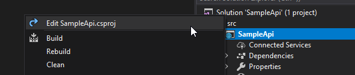

# Creating an Empty Web Project

For this activity, please ensure you have completed [Activity 1](01-InstallTooling.md) to install the required tooling.

## What's the plan?

We're going to use the command line and dotnet CLI to create the structure for our API project amd solution.

We could use the Visual Studio UI and tooling for this also, but let's see how easily the cross platform CLI supports working with projects and templates.

## Activity Steps

1. Open a command prompt from your preferred project directory e.g. 'C:\Projects\'.
2. Create a 'SampleApi' folder.

```md SampleApi```

3. Change to the 'SampleApi' folder.

```cd SampleApi```

4. Pin the SDK version for these activies to 2.1.403 

```dotnet new globaljson --sdk-version 2.1.403```

5. Create a 'src' folder. *NOTE: Using src is a common pattern.*

```md src```

6. Change to the 'src' folder.

```cd src```

7. Use the dotnet CLI to create an empty web project called SampleApi.

```dotnet new web --name SampleApi --no-https```

8. Change boot to the root directory.

```cd ..```

9. Use the dotnet CLI to create a new empty solution

```dotnet new sln```

10. Add the SampleApi project to the solution.

```dotnet sln add .\src\SampleApi\SampleApi.csproj```

11. Use the dotnet CLI to build the solution.

```dotnet build```

12. Use the dotnet CLI to run the application

```dotnet run --project src/SampleApi/SampleApi.csproj```

*NOTE: By default the application will be hosted on port 5000. If this conflicts with anything you can override the port using the switch  --urls "http://localhost:PORT"*

13. Open a browser to test the application by navigating to http://localhost:5000

To close, we'll clean up some items added by the default web project template which we do not need. This is not absolutely required but keeps everything clean.

14. Begin editing the SampleApi project inside Visual Studio



16. Remove the entire ItemGroup which specified the folder include for the wwwroot folder.
17. Remove the package reference to 'Microsoft.AspNetCore.Razor.Design' which is not needed for an API project.

The csproj file for SampleApi should look like this once you have finished...

```xml
<Project Sdk="Microsoft.NET.Sdk.Web">

  <PropertyGroup>
    <TargetFramework>netcoreapp2.1</TargetFramework>
  </PropertyGroup>

  <ItemGroup>
    <PackageReference Include="Microsoft.AspNetCore.App" />
  </ItemGroup>

</Project>
```

15. Explore to the 'src/SampleApi' directory from Windows Explorer and delete the 'wwwroot' folder. This is not needed for an API project since we will not serve any static files.

## End of Activity

By this point you should be able to double click the solution file to open the SampleApi project in Visual Studio 2017.

The completed example for this activity can be found in the '/steps/02-Create-Solution-And-Project' folder.

[Return to README and activity links](../README.md)