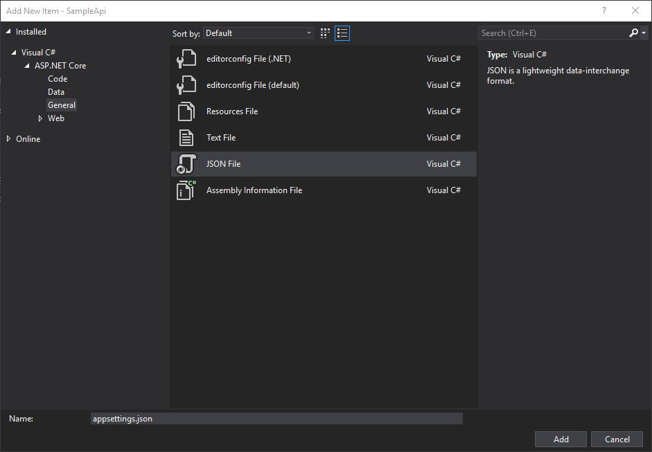

# Configuration

For this activity, please ensure you have completed [Activity 7](07-AcceptingPostedData.md) and have your solution open in Visual Studio 2017.

## What's the plan?

We're going to add the concept of configuration to our API. We'll configure the application using an appsettings.json file.  We'll use the Options pattern in our SampleController to retrieve the configured value which we'll use to control the output from an endpoint in our API.

## Activity Steps

1. Create a JSON file called 'appsettings.json' at the root of the project.



2. Add a 'Messages' section to the configuration file. Include a setting called 'WelcomeMessage' with a value of 'Hey'. Once complete, the contents of your appsettings.json file should be as follows...

``` javascript
{
  "Messages": {
    "WelcomeMessage": "Hey"
  }
}
```

3. Create a new folder called 'Configuration'
4. Create a new class called 'MessagesConfiguration' in the 'Configuration' folder with a single `string` property called 'WelcomeMessage'.

``` csharp
public class MessagesConfiguration
{
    public string WelcomeMessage { get; set; }
}
```

5. At the top of the Startup class, add a public constructor accepting an IConfiguration object. Store this into a public read-only property.

``` csharp
public IConfiguration Configuration { get; }

public Startup(IConfiguration  configuration)
{
    Configuration = configuration;
}
```

6. In the ConfigureServices method of the Startup class; add a line to bind the configuration to our typed configuration class. Call the `Configure` on the `IServiceCollection` passing the type for the 'MessagesConfiguration' into the generic parameter. This method accepts an `IConfig` object which we get by calling `GetSection` on the `IConfiguration` property, passing the section name to read and bind. Once complete the ConfigureServices method should be as follows...

``` csharp
public void ConfigureServices(IServiceCollection services)
{
    services.Configure<MessagesConfiguration>(Configuration.GetSection("Messages"));

    services.AddMvc().SetCompatibilityVersion(CompatibilityVersion.Version_2_1);
}
```

*NOTE: This will require a using statement for 'SampleApi.Configuration'.*

7. Add a constructor to the SampleController accepting an `IOptions<MessagesConfiguration>` and store the object in a private read-only field.

*NOTE: This will require a using statement for 'SampleApi.Configuration' and 'Microsoft.Extensions.Options'.*

``` csharp
private readonly IOptions<MessagesConfiguration> _messagesConfig;

public SampleController(IOptions<MessagesConfiguration> messagesConfig)
{
    _messagesConfig = messagesConfig;
}
```

8. Update the 'Hello' method to use the welcome message from the configuration.

``` csharp
model.WelcomeMessage = $"{_messagesConfig.Value.WelcomeMessage} {name ?? "whoever you are!"}";
```

9. Run the application by pressing F5.
10. Create a JSON file called 'appsettings.development.json' at the root of the project.
11. Copy in the 'Messages' section from appsettings.json' into the new configuration file. 
12. Update the value of the 'WelcomeMessage' setting to 'Hey from dev'. Once complete the contents of your appsettings.json file should be as follows...

``` javascript
{
  "Messages": {
    "WelcomeMessage": "Hey from dev"
  }
}
```

13. Run the application by pressing F5.

## End of Activity

The completed example for this activity can be found in the '/steps/08-Configuration' folder.

Continue to [Activity 9](09-Logging.md).

[Return to README and activity links](../README.md)
