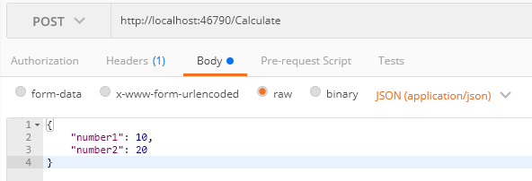

# Accepting Posted Data

For this activity, please ensure you have completed [Activity 5](5-BindingFromQueryString) and have your solution open in Visual Studio 2017.

1. Create a new class called 'CalculateOutputModel' in the 'OutputModels' folder.

``` csharp
public class CalculateOutputModel
{
    public int Result { get; set; }
}
```

2. Create a new folder called 'InputModels'
3. Create a new class called 'CalculateInputModel' in the 'InputModels' folder.

``` csharp
public class CalculateInputModel
{
    public int Number1 { get; set; }
    public int Number2 { get; set; }
}
```

4. Add a new method to the SampleController called 'Calculate'...

``` csharp
[HttpPost]
[Route("calculate")]
public ActionResult<CalculateOutputModel> Calculate(CalculateInputModel input)
{
    var result = new CalculateOutputModel { Result = input.Number1 + input.Number2 };

    return Ok(result);
}
```

5. Run the application by pressing F5.

6. Copy the URL from the address bar.

7. Open Postman (or your application of choice) and create a POST request to your copied URL, adding a path of '/Calculate'.
8. Add the following body to the POST request...

``` javascript
{
   "number1": 10,
   "number2": 20
}
```

*NOTE: If using postman, your UI should be similar to the following, although your port will likely differ.*



9. Send the request and check the response.
10. Change your request body to include invalid data such as a string value...

``` javascript
{
   "number1": 10,
   "number2": 'this is invalid'
}
```

11. Send the request and check the response.

## End of Activity

The completed example for this activity can be found in the '/steps/6-Accepting-Posted-Data' folder.

[Return to README and activity links](../README.md)