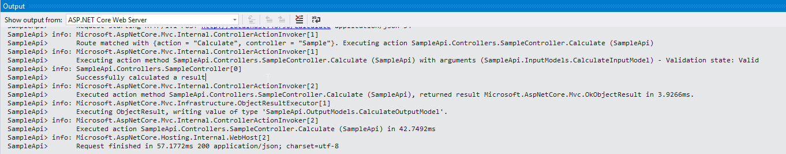

# Logging

For this activity, please ensure you have completed [Activity 7](7-Configuration.md) and have your solution open in Visual Studio 2017.

1. Update the constructor of the SampleController to accept an `ILogger<SampleController>` and store the object in a private field.

``` csharp
private readonly ILogger<SampleController> _logger;

public SampleController(IOptions<MessagesConfiguration> messagesConfig, ILogger<SampleController> logger)
{
    _messagesConfig = messagesConfig;
    _logger = logger;
} 
```

2. Update the Calculate method to make use of logging as follows...

``` csharp
public ActionResult<CalculateOutputModel> Calculate(CalculateInputModel input)
{
    var result = new CalculateOutputModel();

    try
    {
        result.Result = input.Number1 + input.Number2;
        _logger.LogInformation("Successfully calculated a result");
    }
    catch (Exception ex)
    {
        _logger.LogError(ex, "Unable to calculate a result");
    }
    return Ok(result);
}
```

3. Run the application by pressing F5.
4. Send a post request using Postman. Use the same steps found in [Activity 6](6-AcceptingPostedData.md)
5. In Visual Studio, check the output window, showing out from "ASP.NET Core Web Server".
 


## End of Activity

The completed example for this activity can be found in the '/steps/8-Logging' folder.

[Return to README and activity links](../README.md)